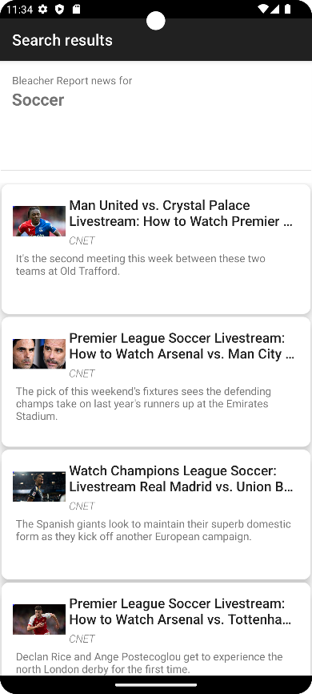

# News App (Android App)
[Full Project Report (pdf)](SUMMARY%2FReport%20-%20Project.pdf)
### This app lets users get news articles by searching keywords, tapping on a location on Google Maps or just viewing the top headline news

## Features
- Search allows for filtering between categories
- Google Maps allows user to click on a location and view local news

